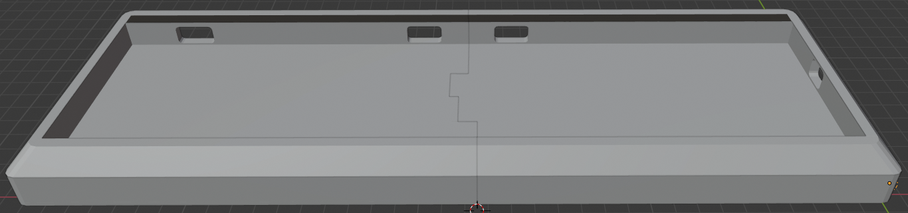
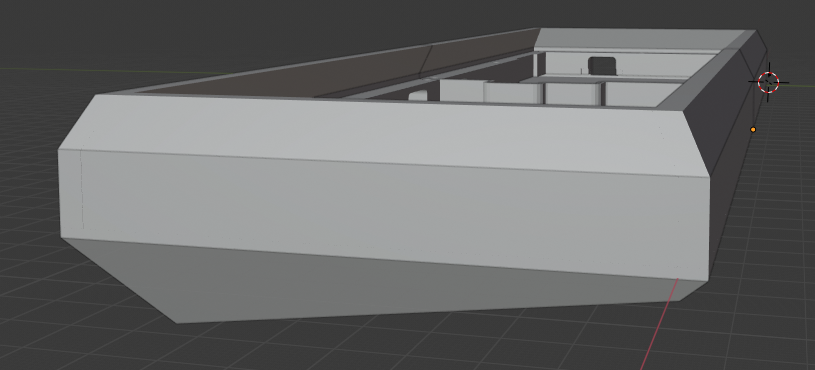
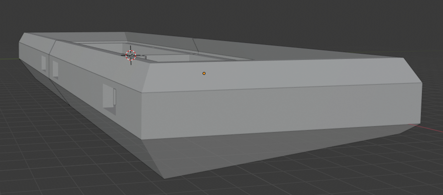
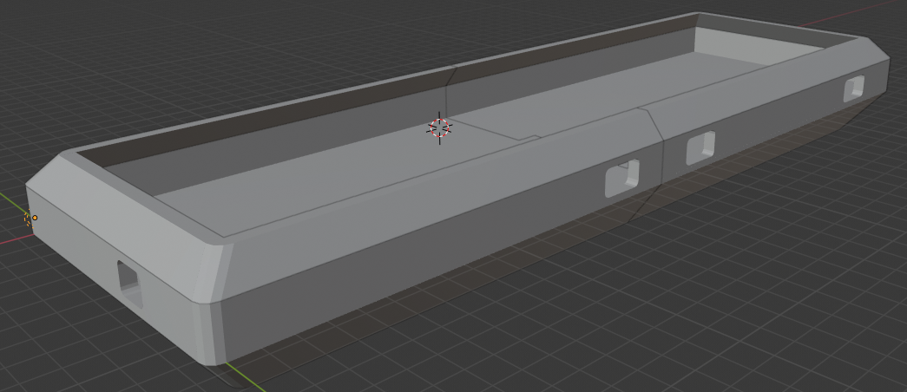

# quefrency-case
models for my custom designed case for the keebio quefrency keyboard

I suggest increasing the size by 1% when you go to print or else you might have to do some sanding to get the keyboard to fit in there.

